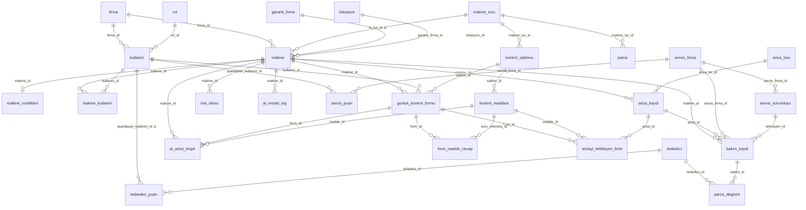

# 🔬 Endux `init.sql` — Normalizasyon & Yapısal Analiz Raporu

> **Analiz Tarihi:** 3 Nisan 2026  
> **Dosya:** `db-init/init.sql` (692 satır, 24 tablo)  
> **Hedef DBMS:** PostgreSQL

---

## 📋 İçindekiler

1. [Genel Özet](#genel-özet)
2. [Tablo Envanteri](#tablo-envanteri)
3. [Normalizasyon Analizi (1NF → 3NF)](#normalizasyon-analizi)
4. [Veri Tipi Tutarsızlıkları](#veri-tipi-tutarsızlıkları)
5. [Yapısal Sorunlar](#yapısal-sorunlar)
6. [İsimlendirme Tutarsızlıkları](#i̇simlendirme-tutarsızlıkları)
7. [Eksik Kısıtlamalar & İndeksler](#eksik-kısıtlamalar--i̇ndeksler)
8. [Foreign Key Tasarım Sorunları](#foreign-key-tasarım-sorunları)
9. [Öneri Özet Tablosu](#öneri-özet-tablosu)

---

## Genel Özet

Veritabanı şeması **büyük ölçüde 3NF uyumlu** bir tasarıma sahiptir. `makine_turu`, `ariza_turu`, `rol` gibi lookup tabloları doğru şekilde ayrışmış, FK ilişkileri genel olarak tutarlıdır. Ancak aşağıdaki kategorilerde **kritik ve orta düzeyde sorunlar** tespit edilmiştir:

| Kategori | Kritik | Orta | Düşük |
|---|:---:|:---:|:---:|
| Normalizasyon İhlalleri | 3 | 2 | 1 |
| Veri Tipi Tutarsızlıkları | 4 | 3 | 2 |
| Yapısal Sorunlar | 3 | 4 | — |
| İsimlendirme Tutarsızlıkları | — | 5 | 3 |
| Eksik Kısıtlamalar | 2 | 3 | — |

---

## Tablo Envanteri

| # | Tablo | Sütun Sayısı | PK Tipi | Rolü |
|---|---|:---:|---|---|
| 1 | `firma` | 6 | serial | Ana firma (multi-tenant kökü) |
| 2 | `rol` | 2 | serial | Lookup — kullanıcı rolleri |
| 3 | `kullanici` | 11 | serial | Sistem kullanıcıları |
| 4 | `lokasyon` | 5 | serial | Makine konumu |
| 5 | `makine_turu` | 4 | serial* | Lookup — makine türleri |
| 6 | `makine` | 14 | serial | Makineler (merkezi varlık) |
| 7 | `makine_ozellikleri` | 4 | serial | Makine teknik özellikleri (JSONB) |
| 8 | `makine_kullanim` | 5 | serial* | Operatör-makine kullanım kaydı |
| 9 | `garanti_firma` | 3 | serial | Garanti sağlayıcı firmalar |
| 10 | `kontrol_sablonu` | 5 | serial | Kontrol formu şablonları |
| 11 | `kontrol_maddesi` | 5 | serial | Şablon kontrol maddeleri |
| 12 | `genel_sorular` | 4 | serial | Genel kontrol soruları |
| 13 | `gunluk_kontrol_formu` | 7 | serial | Günlük kontrol formları |
| 14 | `form_madde_cevap` | 6 | serial | Form cevapları |
| 15 | `ariza_turu` | 2 | serial | Lookup — arıza türleri |
| 16 | `ariza_kaydi` | 8 | serial | Arıza kayıtları |
| 17 | `arizayi_tetikleyen_form` | 8 | serial | Arıza-form ilişkisi (köprü) |
| 18 | `bakim_kaydi` | 9 | serial | Bakım kayıtları |
| 19 | `servis_firma` | 7 | serial | Servis firmaları |
| 20 | `servis_sorumlusu` | 7 | serial* | Servis teknisyenleri |
| 21 | `servis_puan` | 5 | serial | Servis firma puanlama |
| 22 | `tedarikci` | 10 | serial | Tedarikçi firmalar |
| 23 | `tedarakci_puan` | 5 | serial | Tedarikçi puanlama |
| 24 | `parca` | 5 | serial | Parça kataloğu |
| 25 | `parca_degisim` | 8 | serial* | Bakımda değişen parçalar |
| 26 | `risk_skoru` | 4 | serial | Makine risk skorları |

> `*` → Sequence adı tablo adıyla uyuşmuyor (eski isimden kalan)

---

## Normalizasyon Analizi

### ✅ 1NF (Birinci Normal Form) Kontrolü

> **Kural:** Her sütun atomik değer içermeli, tekrarlı gruplar olmamalı.

| Tablo | Sütun | Durum | Açıklama |
|---|---|:---:|---|
| `kullanici` | `not` (`text[]`) | ⚠️ **İHLAL** | PostgreSQL dizisi atomik değildir. Notlar ayrı bir tabloya taşınmalı. |
| `makine_ozellikleri` | `teknik_ozellikler` (`jsonb`) | ⚠️ **TARTIŞMALI** | JSONB, esnek şema için kabul edilebilir ancak yapılandırılmış veriler (motor gücü, devir sayısı vb.) 1NF'yi teknik olarak ihlal eder. |
| `servis_firma` | `uzmanlik_alani` (`varchar`) | ⚠️ **İHLAL RİSKİ** | Tek metin alanında birden fazla uzmanlık alanı girilme riski var. M:N ilişki tablosu gerekir. |

#### 🔧 Önerilen Düzeltmeler

**1. `kullanici.not` → Ayrı tablo:**
```sql
CREATE TABLE IF NOT EXISTS public.kullanici_not (
    not_id     serial PRIMARY KEY,
    kullanici_id integer NOT NULL REFERENCES kullanici(kullanici_id),
    icerik     text NOT NULL,
    olusturma_tarihi timestamp with time zone DEFAULT CURRENT_TIMESTAMP
);
-- kullanici tablosundan "not" sütunu kaldırılır
ALTER TABLE public.kullanici DROP COLUMN IF EXISTS "not";
```

**2. `servis_firma.uzmanlik_alani` → M:N ilişki:**
```sql
CREATE TABLE IF NOT EXISTS public.uzmanlik_alani (
    uzmanlik_id  serial PRIMARY KEY,
    uzmanlik_adi varchar(100) NOT NULL UNIQUE
);

CREATE TABLE IF NOT EXISTS public.servis_firma_uzmanlik (
    servis_firma_id integer NOT NULL REFERENCES servis_firma(servis_firma_id),
    uzmanlik_id     integer NOT NULL REFERENCES uzmanlik_alani(uzmanlik_id),
    PRIMARY KEY (servis_firma_id, uzmanlik_id)
);
```

---

### ✅ 2NF (İkinci Normal Form) Kontrolü

> **Kural:** 1NF'ye uymalı + tüm non-key sütunlar birincil anahtarın **tamamına** bağımlı olmalı (kısmi bağımlılık yok).

Tüm tablolar tek sütunlu surrogate key (serial) kullandığı için **kısmi bağımlılık yapısal olarak mümkün değildir**. Ancak mantıksal olarak şu sorun var:

| Tablo | Sorun | Açıklama |
|---|---|---|
| `parca_degisim` | **Veri tekrarı** | `parca_adi`, `tahmini_omur_saati`, `makine_tur_id` sütunları `parca` tablosunda zaten mevcut. Burada tekrar denormalize. |

#### 🔧 Önerilen Düzeltme

```sql
-- parca_degisim tablosunu parca tablosuna FK ile bağla
ALTER TABLE public.parca_degisim
    ADD COLUMN parca_katalog_id integer REFERENCES parca(parca_id);

-- Tekrarlı sütunları kaldır (migration sonrası)
-- ALTER TABLE public.parca_degisim DROP COLUMN parca_adi;
-- ALTER TABLE public.parca_degisim DROP COLUMN tahmini_omur_saati;
-- ALTER TABLE public.parca_degisim DROP COLUMN makine_tur_id;
```

---

### ✅ 3NF (Üçüncü Normal Form) Kontrolü

> **Kural:** 2NF'ye uymalı + non-key sütunlar arasında **geçişli bağımlılık** olmamalı.

| Tablo | Sütun | İhlal Tipi | Açıklama |
|---|---|---|---|
| `makine` | `garanti_suresi` + `garanti_bitis_tarihi` | **Türetilmiş veri** | `garanti_bitis_tarihi` = `satin_alma_tarihi + garanti_suresi`. İkisinin birlikte tutulması 3NF ihlalidir (güncelleme anomalisi riski). |
| `servis_firma` | `ortalama_puan` | **Hesaplanabilir** | `servis_puan` tablosundan `AVG(puan)` ile hesaplanabilir. Materialized cache olarak tutuluyorsa, güncelleme mekanizması (trigger) gerekir. |
| `tedarikci` | `ortalama_puan` | **Hesaplanabilir** | Aynı sorun — `tedarakci_puan` tablosundan türetilebilir. |
| `makine` | `mevcut_risk_skoru` | **Hesaplanabilir** | `risk_skoru` tablosundan son kayıt çekilebilir. |
| `makine` | `top_calisma_saati` | **Hesaplanabilir** | `makine_kullanim` tablosundan `SUM(top_calisma_zamani)` ile türetilebilir. |

> [!WARNING]
> `ortalama_puan` ve `mevcut_risk_skoru` gibi türetilmiş değerlerin tabloda tutulması **güncelleme anomalisi** oluşturur. `servis_puan` tablosuna yeni kayıt eklendiğinde `servis_firma.ortalama_puan` güncellenmezse veri tutarsızlığı oluşur.

#### 🔧 Önerilen Yaklaşım — Trigger ile Senkronizasyon

```sql
-- Eğer performans için cache tutulacaksa:
CREATE OR REPLACE FUNCTION update_servis_puan_avg()
RETURNS TRIGGER AS $$
BEGIN
    UPDATE servis_firma
    SET ortalama_puan = (
        SELECT ROUND(AVG(puan), 2)
        FROM servis_puan
        WHERE servis_firma_id = COALESCE(NEW.servis_firma_id, OLD.servis_firma_id)
    )
    WHERE servis_firma_id = COALESCE(NEW.servis_firma_id, OLD.servis_firma_id);
    RETURN NEW;
END;
$$ LANGUAGE plpgsql;

CREATE TRIGGER trg_servis_puan_update
    AFTER INSERT OR UPDATE OR DELETE ON servis_puan
    FOR EACH ROW EXECUTE FUNCTION update_servis_puan_avg();
```

---

## Veri Tipi Tutarsızlıkları

Bu bölüm, şemadaki **en kritik teknik sorunlardan** birini oluşturmaktadır.

### 🔴 Kritik: `time with time zone` vs `timestamp with time zone`

Birçok tabloda tarih/saat alanları `time with time zone` olarak tanımlı. Bu sadece **saat bilgisi** tutar (tarih bilgisi olmadan) ve kesinlikle yanlıştır.

| Tablo | Sütun | Mevcut Tip | Olması Gereken |
|---|---|---|---|
| `ai_ariza_tespit` | `tespit_tarihi` | `time with time zone` | `timestamp with time zone` |
| `ai_model_log` | `tahmin_tarihi` | `time with time zone` | `timestamp with time zone` |
| `ariza_kaydi` | `baslangic_zamani` | `time with time zone` | `timestamp with time zone` |
| `ariza_kaydi` | `bitis_zamani` | `time with time zone` | `timestamp with time zone` |
| `ariza_kaydi` | `olusturma_tarihi` | `time with time zone` | `timestamp with time zone` |
| `arizayi_tetikleyen_form` | `tespit_tarihi` | `time with time zone` | `timestamp with time zone` |
| `risk_skoru` | `hesaplama_tarihi` | `time with time zone` | `timestamp with time zone` |
| `tedarikci` | `kayit_tarihi` | `time with time zone` | `timestamp with time zone` |

> [!CAUTION]
> **Bu sorun veri kaybına neden olur.** `time with time zone` tarih bileşenini (yıl-ay-gün) hiçbir şekilde saklamaz. Örneğin `2026-04-03 14:30:00+03` → sadece `14:30:00+03` olarak kaydedilir.

#### 🔧 Toplu Düzeltme

```sql
ALTER TABLE ai_ariza_tespit ALTER COLUMN tespit_tarihi TYPE timestamp with time zone;
ALTER TABLE ai_model_log ALTER COLUMN tahmin_tarihi TYPE timestamp with time zone;
ALTER TABLE ariza_kaydi ALTER COLUMN baslangic_zamani TYPE timestamp with time zone;
ALTER TABLE ariza_kaydi ALTER COLUMN bitis_zamani TYPE timestamp with time zone;
ALTER TABLE ariza_kaydi ALTER COLUMN olusturma_tarihi TYPE timestamp with time zone;
ALTER TABLE arizayi_tetikleyen_form ALTER COLUMN tespit_tarihi TYPE timestamp with time zone;
ALTER TABLE risk_skoru ALTER COLUMN hesaplama_tarihi TYPE timestamp with time zone;
ALTER TABLE tedarikci ALTER COLUMN kayit_tarihi TYPE timestamp with time zone;
```

---

### 🟠 Orta: `char` vs `varchar` Tutarsızlığı

`char(n)` sabit uzunluklu, boşluklarla doldurulur; karşılaştırmalarda sorun çıkarır. Genel kural: **her zaman `varchar` kullanın.**

| Tablo | Sütun | Mevcut | Öneri |
|---|---|---|---|
| `ai_ariza_tespit` | `tahmin_edilen_ariza` | `char(200)` | `varchar(200)` veya `text` |
| `ai_ariza_tespit` | `model_versiyon` | `char(100)` | `varchar(100)` |
| `kullanici` | `soyad` | `char(50)` | `varchar(50)` |
| `kullanici` | `telefon` | `char(20)` | `varchar(20)` |
| `arizayi_tetikleyen_form` | `tetikleyici_deger` | `char(1)` | `varchar(10)` veya `boolean` |
| `servis_sorumlusu` | `unvan` | `"char"` (1 byte!) | `varchar(50)` |

> [!WARNING]
> `servis_sorumlusu.unvan` sütunu PostgreSQL'in özel dahili `"char"` tipini (çift tırnakla) kullanmaktadır. Bu **yalnızca 1 byte** tutar ve kullanıcı verileri için uygun değildir. Bu muhtemelen bir tasarım hatasıdır.

---

### 🟡 Düşük: Precision Sorunları

| Tablo | Sütun | Mevcut | Sorun |
|---|---|---|---|
| `makine` | `top_calisma_saati` | `numeric(5,2)` | Maks. 999.99 saat ≈ 41 gün. Endüstriyel makineler için **çok düşük**. `numeric(10,2)` olmalı. |
| `parca` | `tahmini_omur_saati` | `numeric(6,4)` | Maks. 99.9999 saat ≈ 4 gün. Parça ömrü genelde binlerce saat. `numeric(8,2)` olmalı. |
| `risk_skoru` | `risk_skoru` | `numeric(5,2)` | Kullanım bağlamına uygun, sorun yok. |
| `arizayi_tetikleyen_form` | `sapma_orani` | `numeric(3,2)` | Maks. 9.99. Yüzde olarak kullanılıyorsa `numeric(5,2)` (100.00'a kadar) olmalı. |

---

## Yapısal Sorunlar

### 🔴 S1: `parca_degisim` Tablosu — Denormalize Klon

`parca_degisim` tablosu, `parca` tablosunun sütunlarını tekrar ediyor:

```
parca_degisim                    parca
─────────────                    ─────
parca_adi         ←─ tekrar ─→   parca_adi
tahmini_omur_saati ←─ tekrar ─→  tahmini_omur_saati
makine_tur_id      ←─ tekrar ─→  makine_tur_id
```

Ancak `parca_degisim.parca_id` bir FK değil, kendi PK'sıdır. `parca` tablosuyla **hiçbir ilişki kurulmamış**.

> [!IMPORTANT]
> Bu tasarım, parça bilgilerinin iki yerde güncellenmesini zorunlu kılar (güncelleme anomalisi) ve `parca` kataloğunun amacını ortadan kaldırır.

---

### 🔴 S2: `genel_sorular` Tablosu — Yetim Tablo

`genel_sorular` tablosunun **hiçbir FK ilişkisi yoktur**. Ne başka bir tabloya referans verir, ne de başka bir tablo ona referans verir.

Bu tablo aşağıdaki sorulara cevap beklemektedir:
- `kontrol_maddesi` ile ilişkisi nedir?
- `form_madde_cevap` bu tablodaki soruları da kapsıyor mu?
- Şablondan bağımsız "genel" sorular mı var?

---

### 🔴 S3: `bakim_kaydi.ariza_id` — Zorunlu FK Sorunu

`ariza_id` sütunu `NOT NULL` olarak tanımlı. Bu, **arıza olmadan bakım kaydı oluşturulmasını engeller**. TPM sisteminde periyodik/önleyici bakımlar arıza kayıtsız oluşturulmalıdır.

```sql
-- Düzeltme
ALTER TABLE public.bakim_kaydi ALTER COLUMN ariza_id DROP NOT NULL;
```

---

### 🟠 S4: `bakim_kaydi.bakim_turu` — Inline String

`bakim_turu` sütunu `varchar(50)` olarak tanımlı. Değerler (`Periyodik`, `Arızi`, `Kestirimci` vb.) sabit bir küme oluşturuyorsa bir lookup tablosu veya PostgreSQL `ENUM` tipi kullanılmalıdır.

```sql
CREATE TYPE bakim_turu_enum AS ENUM ('periyodik', 'arizi', 'kestirimci', 'onleyici');
-- veya
CREATE TABLE bakim_turu (
    bakim_tur_id serial PRIMARY KEY,
    bakim_tur_adi varchar(50) NOT NULL UNIQUE
);
```

---

### 🟠 S5: `garanti_firma` vs `servis_firma` vs `tedarikci` — Firma Çoğullaması

Sistemde **dört farklı firma varlığı** var:

| Tablo | Amaç |
|---|---|
| `firma` | Ana firma (abonelik sahibi) |
| `garanti_firma` | Garanti sağlayıcı |
| `servis_firma` | Servis/bakım firması |
| `tedarikci` | Parça tedarikçisi |

Bu tablolar çok benzer sütunlar içermektedir (`firma_adi`, `telefon`, `adres`, `email`, `aktiflik`). Gerçek hayatta bir firma hem servis hem tedarikçi olabilir.

**İki yaklaşım:**

| Yaklaşım | Avantaj | Dezavantaj |
|---|---|---|
| Mevcut (ayrı tablolar) | Basit sorgular, net ayrım | Veri tekrarı, M:N ilişki zorluğu |
| Polimorfik tek tablo + rol | DRY, esnek | Karmaşık sorgular, tip güvenliği düşer |

> [!NOTE]
> Mevcut yapı küçük ölçekli sistemde kabul edilebilir, ancak ölçeklendiğinde bir `firma_iliskileri` (firma_id, ilişki_tipi) gibi polimorfik ara tablo düşünülmelidir.

---

### 🟠 S6: `lokasyon` Tablosunda `firma_id` Eksik

`lokasyon` tablosu hangi firmaya ait olduğunu belirtmiyor. Multi-tenant bir sistemde bu, başka firmaların lokasyonlarının görülmesine neden olabilir.

```sql
ALTER TABLE public.lokasyon ADD COLUMN firma_id integer REFERENCES firma(firma_id);
```

---

### 🟠 S7: `makine_ozellikleri` — JSONB Validasyonu Yok

`teknik_ozellikler` JSONB sütunu için veritabanı seviyesinde hiçbir kısıtlama (CHECK constraint) tanımlanmamış. Geçersiz yapıda veri girişini engellemek için:

```sql
ALTER TABLE public.makine_ozellikleri
ADD CONSTRAINT chk_teknik_ozellikler
CHECK (
    teknik_ozellikler ? 'motor_gucu'
    OR teknik_ozellikler ? 'basinc'
    OR teknik_ozellikler ? 'devir_sayisi'
);
```

---

## İsimlendirme Tutarsızlıkları

| # | Sorun | Örnekler | Öneri |
|---|---|---|---|
| 1 | **Typo:** "tedarakci" vs "tedarikci" | `tedarakci_puan` (tablo), `tedarikci` (tablo) | `tedarikci_puan` olmalı |
| 2 | **FK sütun adı ≠ PK sütun adı** | `makine.m_tur_id` → `makine_turu.makine_tur_id` | `makine_tur_id` olmalı |
| 3 | **Tablo-constraint uyumsuzluğu** | `servis_sorumlusu` PK → `teknisyen_pkey` | `servis_sorumlusu_pkey` olmalı |
| 4 | **Sequence adları eski** | `operator_makine_kullanim_id_seq`, `teknisyen_teknisyen_id_seq` | Tablo adıyla uyumlu sequence oluşturulmalı |
| 5 | **Tutarsız `id` son ekleri** | `form_id`, `madde_id` vs `servis_pin` | Tüm PK/FK'larda `_id` soneki kullanılmalı |
| 6 | **Farklı ad kalıpları** | `g_firma_adi`, `firma_adi`, `makine_ad` | `makine_adi` olmalı (tutarlı `_adi` soneki) |
| 7 | **Ayrılmış kelime** | `kullanici."not"` | `notlar` veya `kullanici_notu` olmalı |
| 8 | **Kısaltma tutarsızlığı** | `m_tur_id` vs `makine_tur_id` vs `ariza_tur_id` | Tam isim veya tutarlı kısaltma |

---

## Eksik Kısıtlamalar & İndeksler

### 🔴 Eksik UNIQUE Kısıtlamalar

| Tablo | Sütun(lar) | Açıklama |
|---|---|---|
| `kullanici` | `eposta` | Aynı e-posta ile birden fazla kullanıcı oluşturulabilir |
| `kullanici` | `kullanici_adi` | Aynı kullanıcı adı tekrar edebilir |
| `firma` | `vergi_no` | Aynı vergi numarasıyla birden fazla firma |
| `makine` | `makine_qr` | QR kodu benzersiz olmalı |
| `makine` | `seri_no` | Seri numarası benzersiz olmalı |

```sql
ALTER TABLE kullanici ADD CONSTRAINT uq_eposta UNIQUE (eposta);
ALTER TABLE kullanici ADD CONSTRAINT uq_kullanici_adi UNIQUE (kullanici_adi);
ALTER TABLE firma ADD CONSTRAINT uq_vergi_no UNIQUE (vergi_no);
ALTER TABLE makine ADD CONSTRAINT uq_makine_qr UNIQUE (makine_qr);
ALTER TABLE makine ADD CONSTRAINT uq_seri_no UNIQUE (seri_no);
```

### 🔴 Eksik CHECK Kısıtlamalar

| Tablo | Sütun | Öneri |
|---|---|---|
| `servis_puan` | `puan` | `CHECK (puan BETWEEN 1 AND 5)` |
| `tedarakci_puan` | `puan` | `CHECK (puan BETWEEN 1 AND 5)` |
| `risk_skoru` | `risk_skoru` | `CHECK (risk_skoru BETWEEN 0 AND 100)` |
| `ai_ariza_tespit` | `risk_skoru` | `CHECK (risk_skoru BETWEEN 0.00 AND 1.00)` |

### 🟠 Eksik İndeksler

Aşağıdaki FK sütunlarında indeks tanımlanmamış:

| Tablo | FK Sütun | Önerilen İndeks |
|---|---|---|
| `ai_model_log` | `kullanici_id` | `idx_ai_log_kullanici` |
| `ai_model_log` | `form_id` | `idx_ai_log_form` |
| `servis_puan` | `servis_firma_id` | `idx_spuan_firma` |
| `servis_puan` | `puanlayan_kullanici_id` | `idx_spuan_kullanici` |
| `tedarakci_puan` | `tedarikci_id` | `idx_tpuan_tedarikci` |
| `tedarakci_puan` | `puanlayan_kullanici_id` | `idx_tpuan_kullanici` |
| `makine_kullanim` | `makine_id` | `idx_mkullanim_makine` |

---

## Foreign Key Tasarım Sorunları

### Tutarsız `ON DELETE` Politikaları

| FK | Mevcut | Risk |
|---|---|---|
| `makine_ozellikleri.makine_id → makine` | `ON DELETE CASCADE` | ✅ Doğru — makine silindiğinde özellikleri de silinmeli |
| Diğer tüm FK'lar | `ON DELETE NO ACTION` | ⚠️ Dikkatli değerlendirilmeli |

Silinme davranışları tutarlı bir stratejiyle yönetilmeli:
- **Lookup tablolar** (rol, ariza_turu, makine_turu): `ON DELETE RESTRICT`
- **Bağımlı veriler** (form_madde_cevap → form): `ON DELETE CASCADE`
- **Referans veriler** (bakim_kaydi → makine): `ON DELETE RESTRICT`

### `NOT VALID` FK'lar

Aşağıdaki FK'lar `NOT VALID` ile oluşturulmuş (mevcut verileri kontrol etmez):

| FK | Tablo |
|---|---|
| `fk_form` | `ai_model_log` |
| `fk_kullanici` | `ai_model_log` |
| `fk_ariza_tur` | `ariza_kaydi` |
| `fk_ariza` | `bakim_kaydi` |
| `fk_teknisyen` | `bakim_kaydi` |
| `fk_garanti_id` | `makine` |
| `fk_lokasyon` | `makine` |
| `fk_kullanici` | `makine_kullanim` |
| `fk_makine_tur` | `parca_degisim` |
| `fk_tedarikci` | `parca_degisim` |
| `fk_sorumlusu` | `servis_sorumlusu` |

> [!WARNING]
> `NOT VALID` FK'lar, mevcut verilerdeki tutarsızlıkları tolere eder. Üretim ortamına geçmeden önce `ALTER TABLE ... VALIDATE CONSTRAINT ...` ile tüm veriler doğrulanmalıdır.

---

## Öneri Özet Tablosu

| # | Sorun | Önem | Etki | Çözüm Karmaşıklığı |
|---|:---:|:---:|---|:---:|
| 1 | `time` → `timestamp` dönüşümü | 🔴 Kritik | Veri kaybı | Düşük |
| 2 | `kullanici.not` array kaldırma | 🔴 Kritik | 1NF ihlali | Orta |
| 3 | `parca_degisim` denormalizasyonu | 🔴 Kritik | Güncelleme anomalisi | Orta |
| 4 | UNIQUE kısıtlamalar ekleme | 🔴 Kritik | Veri bütünlüğü | Düşük |
| 5 | `bakim_kaydi.ariza_id NOT NULL` | 🟠 Orta | İş mantığı kısıtı | Düşük |
| 6 | `char` → `varchar` dönüşümü | 🟠 Orta | Sorgu hataları | Düşük |
| 7 | Türetilmiş alanlar (avg puan vb.) | 🟠 Orta | Tutarsız veri | Orta |
| 8 | `numeric` precision düzeltme | 🟠 Orta | Taşma riski | Düşük |
| 9 | Eksik indeksler | 🟠 Orta | Performans | Düşük |
| 10 | `genel_sorular` yetim tablo | 🟡 Düşük | Karışıklık | Karar gerekli |
| 11 | İsimlendirme tutarsızlıkları | 🟡 Düşük | Geliştirici deneyimi | Orta |
| 12 | `NOT VALID` FK validasyonu | 🟠 Orta | Veri bütünlüğü | Düşük |
| 13 | `lokasyon.firma_id` ekleme | 🟠 Orta | Multi-tenant güvenlik | Düşük |
| 14 | `servis_sorumlusu.unvan` tip düzeltme | 🟠 Orta | Veri kaybı | Düşük |

---

## 📊 ER Diyagramı — Sorun Haritası



> ⚠️ işaretli ilişkiler: isimlendirme veya yapısal sorun mevcut

---

> **Not:** Bu rapor `db-init/init.sql` dosyasının statik analizi sonucu oluşturulmuştur. Öneriler, production verisi olmadan hazırlanmıştır; migration sırası ve veri dönüşüm stratejisi gerçek veri durumuna göre planlanmalıdır.
